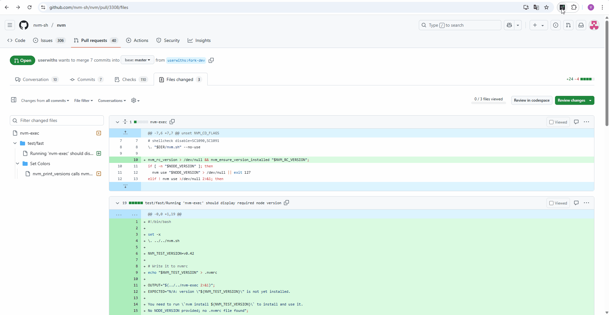

# Git-PR Reviewer Pro

GitHub Pull Request をより効率的にレビューするための Chrome 拡張機能です。AI 要約、Collapse/Expand 操作、高速 UI をサポートします。

---

## 📸 デモ



---

## 🔧 開発手順

### 1. 初期セットアップ

```bash
# Node.js LTS 環境を使用（例: Node 18）
nvm install 18 && nvm use 18

# pnpm を有効化
corepack enable && corepack prepare pnpm@latest --activate

# 依存関係インストール
pnpm install
```

### 2. 開発モードで起動

```bash
pnpm dev
```

* `localhost:5173` で開発サーバーが起動します。
* Chrome 拡張としては `dist/` を Chrome に読み込みます。

### 3. ビルド

```bash
pnpm build
```

* `dist/` フォルダにビルド成果物が出力されます。

---

## ⚙️ 環境変数設定

プロジェクトルートに `.env.local` ファイルを作成してください。

```env
VITE_OPENAI_API_KEY=sk-xxxxxxxxxxxxxxxxxxxx
```

---

## 📁 ディレクトリ構成

```
├── public/                # アイコンなど静的リソース
├── popup.html             # 拡張アイコン用ポップアップ UI
├── options.html           # オプション画面（API キー設定 UI）
├── src/
│   ├── background.ts      # キーボードショートカット & バッジ制御
│   ├── content/           # コンテンツスクリプト（collapse/expand ロジック）
│   ├── popup/Popup.tsx    # ポップアップ UI コンポーネント
│   ├── lib/               # DOM ヘルパーなどユーティリティ
│   └── options/ApiKey.tsx # API キー設定 + 暗号化 PoC
├── vite.config.ts         # Vite + CRXJS ビルド設定
└── manifest.ts            # 拡張のメタ情報 (MV3)
```

---

## 🧪 GitHub Actions CI

`.github/workflows/ci.yml` にて以下をチェック：

* `pnpm install`
* `pnpm build`
* `pnpm test:unit`
* 全ステップ通過 (CI グリーン)

---

## 🛡️ セキュリティ方針

`docs/security.md` に記載：

* API キーは AES-GCM(256bit) にて暗号化し、`chrome.storage.local` に保存
* 復号鍵は `sessionStorage` に保持

---

## 📄 ライセンス

MIT
